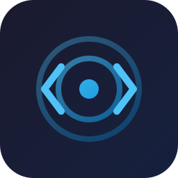

<div align="center">
  
  <h1>⚡ CodeDrill</h1>
  <p><strong>Master DSA & System Design with Science-Backed Interview Practice</strong></p>
</div>

[](https://github.com/afzalmukhtar/codedrill/releases)
[](https://github.com/afzalmukhtar/codedrill)
[](https://github.com/afzalmukhtar/codedrill)
[](LICENSE)

> 🎯 FSRS spaced repetition · 🤖 Dual AI personas · ⏱️ Timed practice · 📚 3,200+ problems · 🔄 Problem mutation · 🏢 660+ company tags

Works with **VS Code** · **Cursor** · **Windsurf**

---

## 📋 Table of Contents

- [✨ Features](#-features)
- [📦 Installation](#-installation)
- [🚀 Quick Start](#-quick-start)
- [🎮 How to Use](#-how-to-use)
- [🤖 AI Providers](#-ai-providers)
- [⚙️ Configuration](#️-configuration)
- [🛠️ Development](#️-development)

---

## ✨ Features

### 🤖 Dual AI Personas

| Mode | When Active | Behavior |
|------|-------------|----------|
| 🔴 **Interviewer** | Timer is running | Concise, professional. Socratic hints only. Never gives answers. Auto-nudges when you're stuck. |
| 🟢 **Teacher** | After Give Up / timer expires | Warm, structured. Problem restatement → brute force → optimal → code walkthrough → complexity → pattern → related problems. |

> Modes switch automatically. Manual override available anytime.

### 📚 3,200+ Problem Library

- 🏷️ Aggregated from **Blind 75**, **NeetCode 150**, **Grind 75**, and **8 curated GitHub repos**
- 🔍 Every problem tagged with **difficulty**, **algorithm pattern** (19 families), and **company data** (660+ companies)
- 🎯 Filter by company, pattern, category, or difficulty in the Problem Browser

### 🧠 Science-Backed Learning

- 📊 **FSRS Spaced Repetition** — Rate yourself Again / Hard / Good / Easy. The algorithm schedules your next review at the optimal interval.
- 🔄 **Problem Mutation** — After 3+ attempts, constraints and inputs are mutated so you learn the pattern, not memorize the answer.
- 👤 **Personalized Profile** — AI analyzes your conversations to build a learner profile with struggle topics, strengths, and preferred explanation style.

### 💻 Developer-First Experience

- 📎 **Code Context** — Active file, selection, and cursor position injected into every AI conversation
- 📝 **Code Scaffolding** — Auto-creates `{problem_name}.py` and `test_{problem_name}.py` with deterministic function names
- 🧪 **20+ Test Cases** — LLM-generated edge cases with forced JSON output for reliable parsing
- ▶️ **Run Tests** — One-click pytest execution from the sidebar
- 📂 **Git Progress Tracking** — Optional git repo with auto-commits and README progress report

### 🏗️ Resume-Driven System Design

1. 📄 Paste your resume in the **Profile** tab
2. 🔬 CodeDrill extracts your seniority, tech stack, and domains
3. 🎯 Generates 5-10 personalized system design topics
4. ⏱️ Promote any topic to a full timed practice session

### 🎨 Rich UI

- 🖍️ Syntax-highlighted code blocks with copy buttons
- 📊 Mermaid diagram support in problem previews
- 🏆 Progress dashboard with streaks, mastery bars, and company coverage
- 📖 GitHub-style markdown preview for problem statements

---

## 📦 Installation

### Option A: From `.vsix` file

Download `codedrill-1.0.0.vsix` from the [releases page](https://github.com/afzalmukhtar/codedrill/releases).

**VS Code:**
```bash
code --install-extension codedrill-1.0.0.vsix
```

**Cursor:**
```bash
cursor --install-extension codedrill-1.0.0.vsix
```

**Windsurf:**
```bash
windsurf --install-extension codedrill-1.0.0.vsix
```

> 💡 **Or in any IDE:** Command Palette (`Cmd+Shift+P` / `Ctrl+Shift+P`) → `Extensions: Install from VSIX...` → select the file.

### Option B: From Marketplace

Search for **CodeDrill** in the Extensions tab of your IDE.

---

## 🚀 Quick Start

### Step 1: Configure an AI model

Click the `+` button at the bottom of the CodeDrill sidebar, or run **CodeDrill: Configure Model Providers** from the Command Palette.

<details>
<summary>🦙 <strong>Ollama (free, local — recommended)</strong></summary>

1. Install from [ollama.com](https://ollama.com)
2. Pull a model: `ollama pull qwen2.5:14b`
3. Config:

```json
{
  "providers": {
    "ollama": { "enabled": true, "baseUrl": "http://localhost:11434" }
  },
  "defaultModel": "qwen2.5:14b"
}
```
</details>

<details>
<summary>🔑 <strong>OpenAI</strong></summary>

```json
{
  "providers": {
    "openai": { "enabled": true, "apiKey": "sk-..." }
  },
  "defaultModel": "gpt-4o"
}
```
</details>

<details>
<summary>🌐 <strong>OpenRouter (300+ models, one key)</strong></summary>

```json
{
  "providers": {
    "openrouter": { "enabled": true, "apiKey": "sk-or-v1-..." }
  },
  "defaultModel": "anthropic/claude-sonnet-4"
}
```
</details>

<details>
<summary>☁️ <strong>Azure OpenAI</strong></summary>

```json
{
  "providers": {
    "azureOpenai": {
      "enabled": true,
      "endpoint": "https://your-resource.openai.azure.com",
      "apiKey": "...",
      "apiVersion": "2024-08-01-preview",
      "deployment": "gpt-4o"
    }
  }
}
```
</details>

> 📄 See `codedrill.config.example.json` for the full template with all 7 providers.

> 🔒 **Security:** Never commit `codedrill.config.json` to git. CodeDrill adds it to `.gitignore` automatically.

### Step 2: Click Practice

CodeDrill picks a problem, fetches its description, scaffolds your solution and test files, and opens everything in your editor.

### Step 3: Code, test, learn 🎉

Set the timer → solve the problem → run tests → rate yourself → spaced repetition handles the rest.

---

## 🎮 How to Use

### Practice Flow

```
🎯 Practice → ⏱️ Timer starts → 🔴 Interviewer mode (hints only)
                                        ↓
                               🏳️ Give Up / ⏰ Timer expires
                                        ↓
                               🟢 Teacher mode (structured explanation)
                                        ↓
                               ⭐ Rate: Again / Hard / Good / Easy
                                        ↓
                               📊 FSRS schedules next review
                                        ↓
                               🔄 3+ attempts → Problem mutates
```

### Sidebar Buttons

| Button | Action |
|--------|--------|
| 🎯 **Practice** | Start a session (random problem from spaced repetition queue) |
| 📚 **Problems** | Browse 3,200+ problems with filters |
| 💬 **History** | Resume past chat sessions |
| 📊 **Stats** | Dashboard with streaks, mastery, and company coverage |
| 👤 **Profile** | Submit resume for personalized system design topics |
| 👁️ **View Problem** | Open problem markdown in a split pane |
| 📝 **Code Stub** | Scaffold solution + test files for any problem |
| ▶️ **Run Tests** | Execute pytest in a terminal |
| 🔄 **Regen Tests** | Re-generate 20+ test cases using AI |
| 🏳️ **Give Up** | Stop timer, switch to Teacher mode |

### ⌨️ Keyboard Shortcuts

| Shortcut | Action |
|----------|--------|
| `Cmd+Alt+P` / `Ctrl+Alt+P` | 🎯 Start Practice Session |
| `Cmd+Alt+D` / `Ctrl+Alt+D` | 📊 Open Dashboard |

---

## 🤖 AI Providers

| Provider | Setup | Cost |
|----------|-------|------|
| 🦙 **Ollama** | Install locally, no key needed | Free |
| 🌐 **OpenRouter** | Single API key, 300+ models | Pay per token |
| 🔑 **OpenAI** | Direct API key | Pay per token |
| ☁️ **Azure OpenAI** | Endpoint + key + deployment | Pay per token |
| 🧠 **Anthropic** | Direct API key | Pay per token |
| 🔍 **Google AI** | Direct API key | Free tier available |
| ⚙️ **Custom** | Any OpenAI-compatible endpoint | Varies |

---

## ⚙️ Configuration

All settings live in `codedrill.config.json` at the workspace root.

```json
{
  "providers": { ... },
  "defaultModel": "qwen2.5:14b",
  "preferences": {
    "timerEasy": 20,
    "timerMedium": 35,
    "timerHard": 50,
    "timerSystemDesign": 45,
    "preferredLanguage": "python",
    "dailyNewProblems": 1,
    "dailyReviewProblems": 1,
    "mutationStartsAtAttempt": 3
  }
}
```

---

## 🛠️ Development

### Prerequisites

- 📦 Node.js 18+
- 🖥️ VS Code / Cursor / Windsurf 1.96.0+

### Setup

```bash
git clone https://github.com/afzalmukhtar/codedrill.git
cd codedrill
npm install
npm run watch
```

Press `F5` to launch the Extension Development Host.

### Build & Package

```bash
npm run build          # 🏗️ Production build
npm run package        # 📦 Create .vsix file
```

### Tech Stack

| Layer | Technology |
|-------|-----------|
| 🧩 Extension | TypeScript, VS Code Extension API |
| 🎨 UI | React 19, Webview API |
| 💾 Database | sql.js (SQLite via WASM) |
| 📊 Scheduling | ts-fsrs (FSRS spaced repetition) |
| 🤖 LLM | openai SDK, ollama, @openrouter/sdk |
| 📝 Markdown | marked + DOMPurify + highlight.js |
| ⚡ Build | esbuild |

---

## 🤝 Contributing

Contributions are welcome! Please read the [CHANGELOG](CHANGELOG.md) and open an issue or PR.

## 📄 License

MIT — see [LICENSE](LICENSE) for details.
